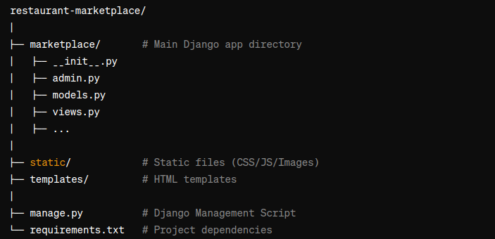

# foodOnline

Welcome to the Project-Based Django Web Development Course! In this course, you'll learn how to build a fully-featured Multi-vendor Restaurant Marketplace website with powerful location-based search and many other complex functionalities.

Table of Contents
1. Project Overview
2. Features
3. Prerequisites
4. Folder Structure
5. Contributing
6. License

## Project Overview
The Multi-vendor Restaurant Marketplace is a web application built with Django that allows multiple restaurant vendors to list their businesses, while customers can search for and order from nearby restaurants.

## Highlights:
Multi-vendor: Multiple restaurants can register and list their menus.
Location-based search: Customers can search for restaurants near their location.
Order management: Complete ordering system for customers and vendors.

## Features:
User Authentication (Signup/Login)
Vendor Management (Restaurant owners)
Menu Management
Customer Location-Based Search
Restaurant Rating and Review System
Order Management System
Admin Dashboard

## Prerequisites
Python: 3.8 or later
Django: 4.0 or later
PostgreSQL/MySQL/SQLite (or your preferred database)

## Folder Structure

## Contributing
We welcome contributions to this project. If you wish to contribute, please follow these steps:
 - Fork the repository.
 - Create a new branch.
 - Make your changes.
 - Open a Pull Request.

## License
This project is licensed under the MIT License. See the LICENSE file for details.

